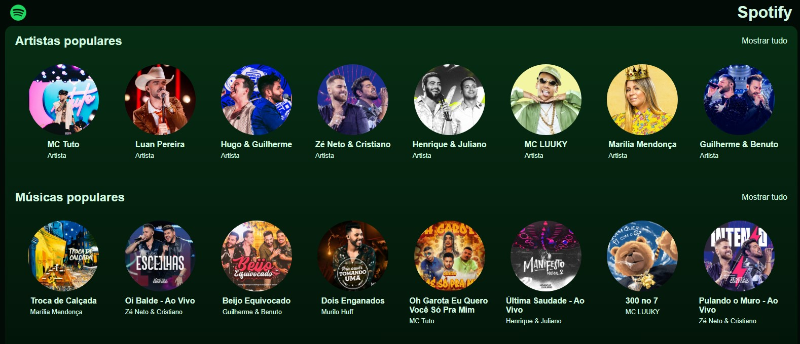

# Spotify Clone



## Índice

- [Sobre o Projeto](#sobre-o-projeto)
- [Funcionalidades](#funcionalidades)
- [Tecnologias Utilizadas](#tecnologias-utilizadas)
- [Instalação](#instalação)
- [Como Usar](#como-usar)
- [Contribuição](#contribuição)
- [Licença](#licença)
- [Contato](#contato)

## Sobre o Projeto

O **Spotify Clone** é uma aplicação web que replica a interface e funcionalidades básicas do Spotify, permitindo que os usuários explorem músicas, criem playlists e desfrutem de uma experiência musical personalizada.

## Funcionalidades

- Reprodução de músicas
- Pesquisa por artistas, álbuns e faixas
- Criação e gerenciamento de playlists
- Interface responsiva e intuitiva

## Tecnologias Utilizadas

- [React](https://reactjs.org/)
- [Tailwind CSS](https://tailwindcss.com/)
- [Spotify Web API](https://developer.spotify.com/documentation/web-api/)

## Instalação

1. Clone o repositório:

   ```bash
   git clone https://github.com/pedrohenriferreira/spotify-clone.git
```
